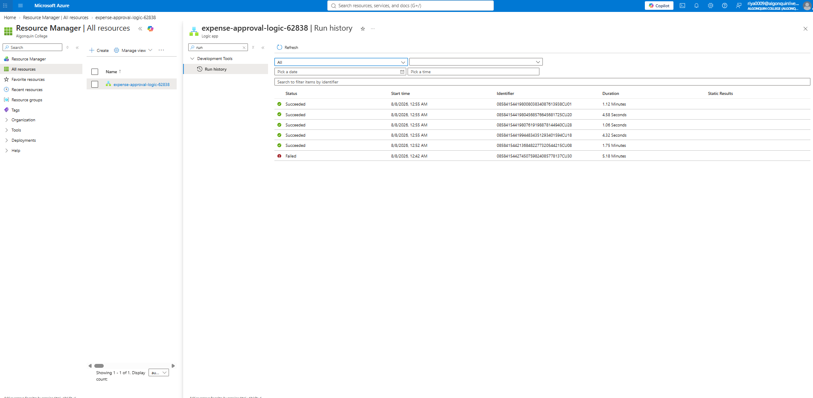
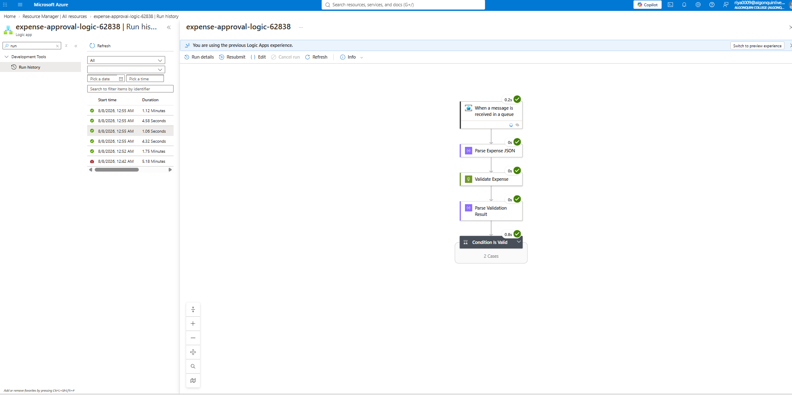
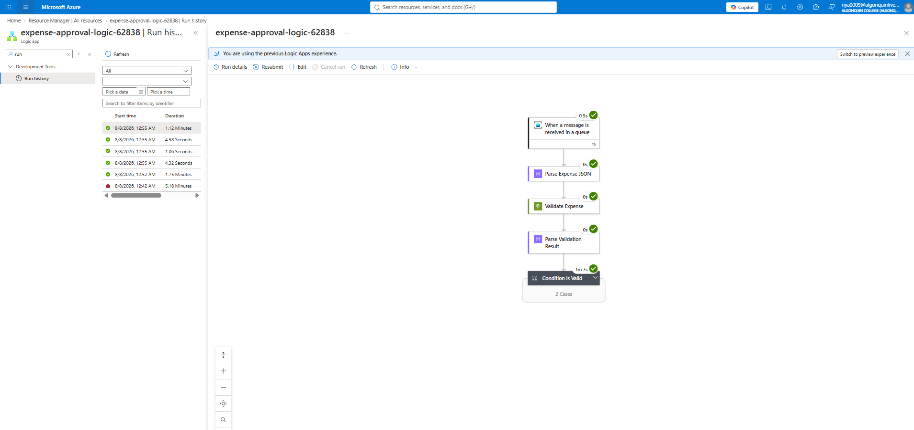
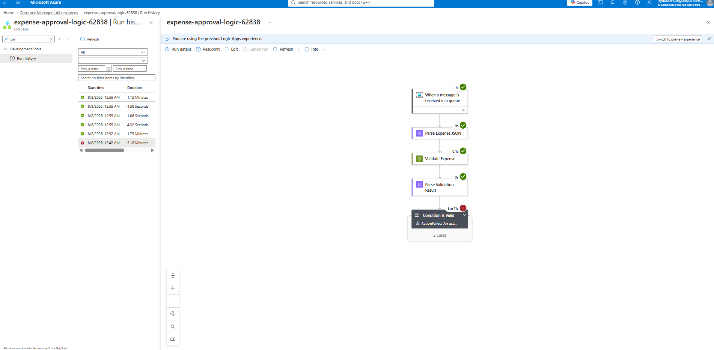
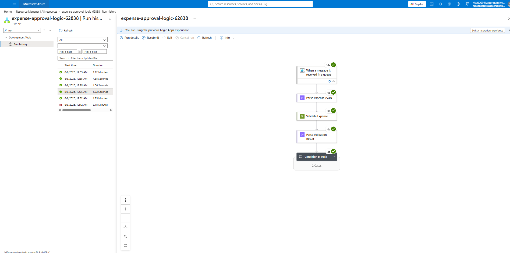
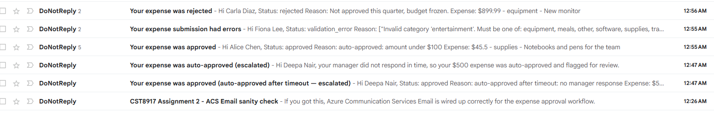
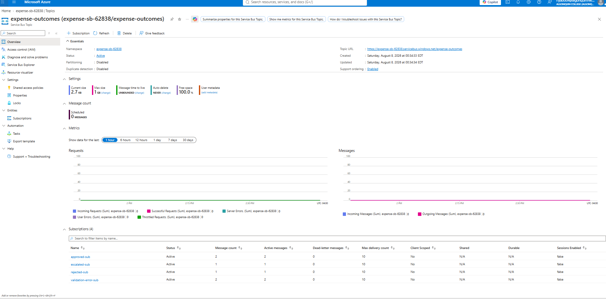
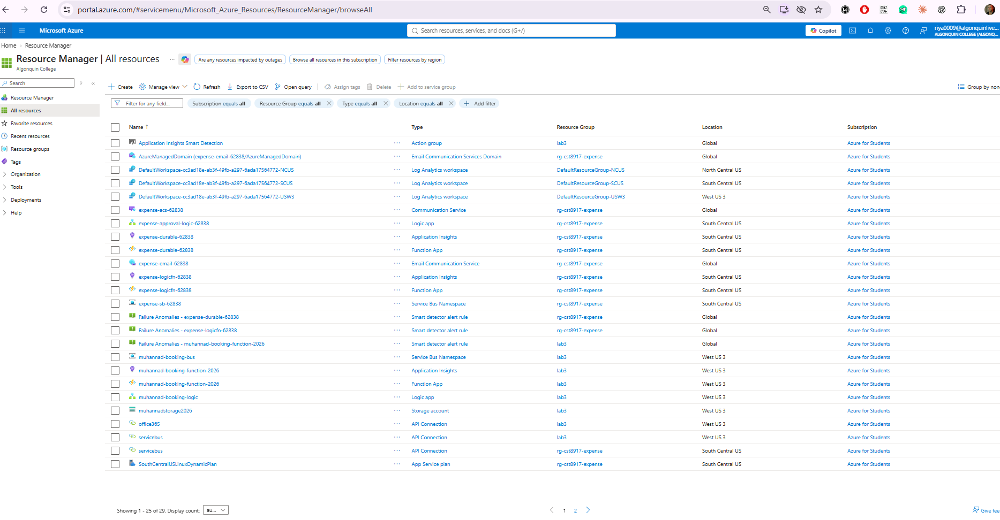

# Screenshots

Captured after deploying Version B to Azure and running the test scenarios in
[`../test-expense.http`](../test-expense.http) against the live
`expense-approval-logic-62838` Logic App.

### 1. Run history — multiple runs, mixed outcomes

### 2. Succeeded run — auto-approve path (Scenario 1)

### 3. Succeeded run — manager-approval path (Scenario 2)

### 3b. Succeeded run — manager-rejects path (Scenario 3)

### 4. Timed-out `Wait_For_Manager_Decision` — escalation (Scenario 4)

Run shows top-level `Failed` status because the wait action itself timed out,
even though the workflow caught it and sent the auto-approved-after-timeout
email.

### 5. Validation-error branch (Scenarios 5 & 6)

### 6. Emails received — approved / rejected / escalated / validation-error

### 7. Service Bus topic subscription message counts

`expense-outcomes` topic → subscriptions, showing messages landed in
`approved-sub`, `rejected-sub`, `escalated-sub`, `validation-error-sub`.

### Bonus: All deployed resources

Resource Manager "All resources" view showing the full set of deployed
Version A + Version B Azure resources.

---

## Notes on the Condition action durations

The Logic App run canvas collapses `Wait_For_Manager_Decision` inside the
`Condition Is Valid` action's branch, so the screenshots show that action's
elapsed time rather than an expanded inner view:

- Auto-approve (Scenario 1): condition resolves in under a second — no wait.
- Manager approves / rejects (Scenarios 2 & 3): condition takes ~1-2 minutes,
  reflecting the real wait for the manager decision webhook callback.
- Timeout escalation (Scenario 4): condition takes just over 5 minutes,
  matching the configured wait timeout before auto-approve-and-escalate fires.
- Validation errors (Scenarios 5 & 6): resolve near-instantly, since no
  manager wait is reached.
